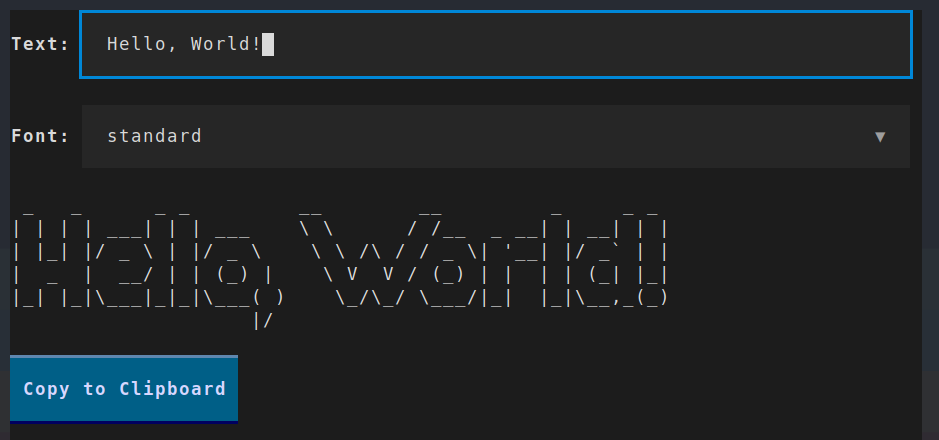

# figtext

[FIGlet](http://www.figlet.org/) + [Textual](https://textual.textualize.io/)
= figtext! A simple TUI for generating text banners.



## Installation

Install `figtext` using [pipx](https://pypa.github.io/pipx/):

```
pipx install git+https://github.com/TomJGooding/figtext.git
```

## Licence

Licensed under the [GNU General Public License v3.0](LICENSE).
